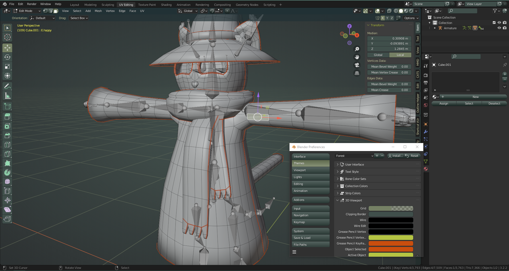

here's an upload of my usual blender theme that i made for myself some time ago. i think it's hard to find the kind of theme i wanted, so it's here for anyone who wants something similar.

**Forest Theme**: 
this is a visual theme for blender 3.2+ that changes the color of your workspace to a more natural green-and-gray color scheme. 

